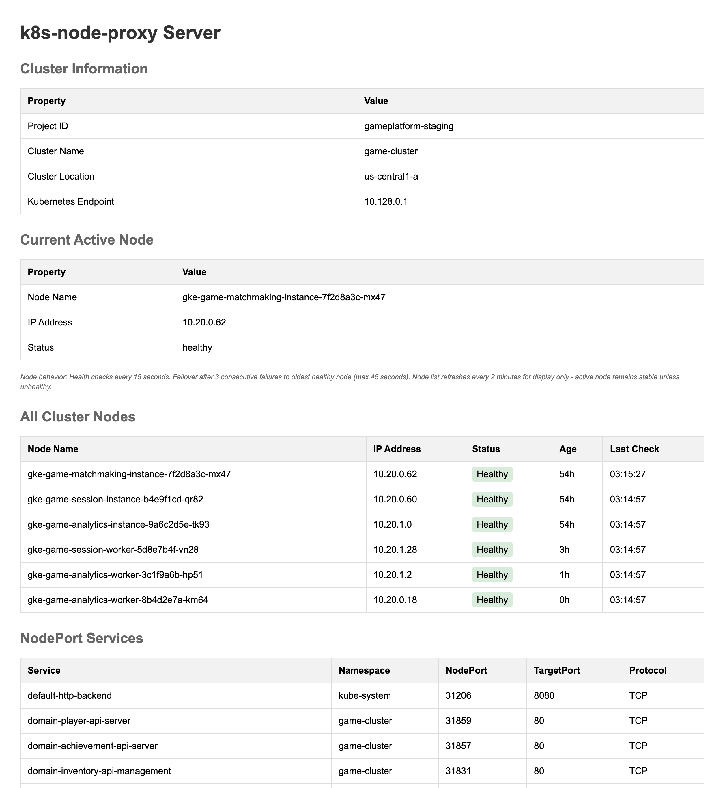

# k8s-node-proxy

A lightweight proxy that provides stable endpoints for Kubernetes NodePort services, automatically handling node failures and IP changes.



## The Problem

NodePort services expose applications on static ports across all cluster nodes, but accessing them is problematic:

**Dynamic infrastructure.** Node IPs change during autoscaling, upgrades, and maintenance. Applications and CI/CD pipelines must constantly update connection strings or fail when nodes are replaced.

**Manual workarounds.** Port forwarding works but requires developers to manually establish connections daily. LoadBalancer services add cost and complexity. Direct node access requires constant IP management.

**Operational overhead.** Teams waste time running kubectl port-forward commands, tracking node IPs, updating configurations, and debugging connection failures caused by infrastructure changes.

## The Solution

k8s-node-proxy provides a stable gateway that automatically routes traffic to healthy nodes:

```
Client → proxy:30001 → healthy-node:30001 → NodePort Service → Pod
```

**Automatic discovery.** Finds all NodePort services in your namespace via Kubernetes API. No manual configuration required.

**Intelligent routing.** Monitors node health continuously and routes to the oldest healthy node for stability. Fails over within 45 seconds when nodes become unhealthy.

**Platform agnostic.** Works with GKE, EKS, and any Kubernetes cluster. Supports in-cluster and external deployment models.

## Quick Start

k8s-node-proxy supports multiple deployment modes:

### GCP/GKE
```bash
PROJECT_ID=my-project NAMESPACE=default ./k8s-node-proxy
```

### AWS/EKS
```bash
AWS_REGION=us-east-1 CLUSTER_NAME=my-cluster NAMESPACE=default ./k8s-node-proxy
```

### Generic Kubernetes (External)
```bash
KUBECONFIG=/path/to/config NAMESPACE=default ./k8s-node-proxy
```

### In-Cluster Deployment
```bash
# No configuration needed - automatically detected when running as a pod
NAMESPACE=default ./k8s-node-proxy
```

The proxy will discover all NodePort services in the namespace, start listeners, and forward traffic automatically.

## Configuration

### Platform Detection

The proxy automatically detects your platform based on environment variables:

| Platform | Required Variables | Optional |
|----------|-------------------|----------|
| **GCP/GKE** | `PROJECT_ID` or `GOOGLE_CLOUD_PROJECT`, `NAMESPACE` | `PROXY_SERVICE_PORT` |
| **AWS/EKS** | `AWS_REGION`, `CLUSTER_NAME`, `NAMESPACE` | `PROXY_SERVICE_PORT` |
| **Generic** | `KUBECONFIG`, `NAMESPACE` | `PROXY_SERVICE_PORT` |
| **In-Cluster** | `NAMESPACE` | `PROXY_SERVICE_PORT` |

**PROXY_SERVICE_PORT:** Management interface port (default: 80)

## Requirements

### GCP/GKE
- Service account with `roles/container.viewer`
- Network access to GKE API server
- Google Application Default Credentials

### AWS/EKS
- IAM role with `eks:DescribeCluster` permission
- AWS credentials configured (SDK default chain)
- Network access to EKS API server

### Generic Kubernetes
- Valid kubeconfig file
- Cluster access configured in kubeconfig

### In-Cluster
- Running as a Kubernetes pod
- Service account with permissions to list nodes and services

## Contributing

### Prerequisites

- Go 1.24.1 or later
- Docker or Colima (for integration tests)
- kind (optional, for local cluster testing): `go install sigs.k8s.io/kind@latest`

### Getting Started

1. **Clone the repository**
   ```bash
   git clone https://github.com/your-org/k8s-node-proxy.git
   cd k8s-node-proxy
   ```

2. **Install dependencies**
   ```bash
   go mod download
   ```

3. **Build the project**
   ```bash
   make build
   ```

4. **Run tests**
   ```bash
   make test
   ```

### Development Workflow

**Build and run locally:**
```bash
make build          # Build binary to bin/k8s-node-proxy
make run            # Run directly with go run
make clean          # Remove build artifacts
```

**Testing:**
```bash
make test           # Run all tests (recommended before committing)
make test-unit      # Unit tests only (30 seconds)
make test-e2e       # E2E tests with mocks (1 minute)
make test-e2e-kind  # Full integration test with kind cluster (10-15 minutes)
```

**Run with race detector:**
```bash
go test -race ./...
```

### Testing Guide

**Quick validation** - Run before every commit:
```bash
make test
```

**Comprehensive validation** - Run before opening a PR:
```bash
make test-e2e-kind
```

The integration test creates a local kind cluster, deploys nginx and the proxy, then validates:
- Service discovery
- Request proxying
- Health monitoring
- Failover behavior
- Concurrent request handling

**Prerequisites for integration tests:**
- Docker or Colima running
- kind installed: `go install sigs.k8s.io/kind@latest`

### Code Structure

```
k8s-node-proxy/
├── cmd/server/          # Entry points and server factories
├── internal/
│   ├── platform/        # Platform detection (GCP, AWS, Generic)
│   ├── nodes/           # Node discovery and health monitoring
│   ├── services/        # Service discovery
│   ├── proxy/           # HTTP proxy handler
│   └── server/          # Server orchestration
└── test/
    ├── e2e/             # End-to-end tests
    ├── mocks/           # Mock servers for testing
    └── helpers/         # Test utilities
```

### Submitting Changes

1. Run tests: `make test`
2. Run integration tests: `make test-e2e-kind`
3. Ensure code builds: `make build && rm -f bin/k8s-node-proxy`
4. Create a pull request

### CI/CD

GitHub Actions runs automatically on every push and PR:
- Unit tests with race detector
- E2E tests with mocks
- Integration tests with kind cluster
- Build verification

Trigger manually: `gh workflow run test.yml`

## License

MIT License

Copyright (c) 2025 k8s-node-proxy contributors

Permission is hereby granted, free of charge, to any person obtaining a copy
of this software and associated documentation files (the "Software"), to deal
in the Software without restriction, including without limitation the rights
to use, copy, modify, merge, publish, distribute, sublicense, and/or sell
copies of the Software, and to permit persons to whom the Software is
furnished to do so, subject to the following conditions:

The above copyright notice and this permission notice shall be included in all
copies or substantial portions of the Software.

THE SOFTWARE IS PROVIDED "AS IS", WITHOUT WARRANTY OF ANY KIND, EXPRESS OR
IMPLIED, INCLUDING BUT NOT LIMITED TO THE WARRANTIES OF MERCHANTABILITY,
FITNESS FOR A PARTICULAR PURPOSE AND NONINFRINGEMENT. IN NO EVENT SHALL THE
AUTHORS OR COPYRIGHT HOLDERS BE LIABLE FOR ANY CLAIM, DAMAGES OR OTHER
LIABILITY, WHETHER IN AN ACTION OF CONTRACT, TORT OR OTHERWISE, ARISING FROM,
OUT OF OR IN CONNECTION WITH THE SOFTWARE OR THE USE OR OTHER DEALINGS IN THE
SOFTWARE.
